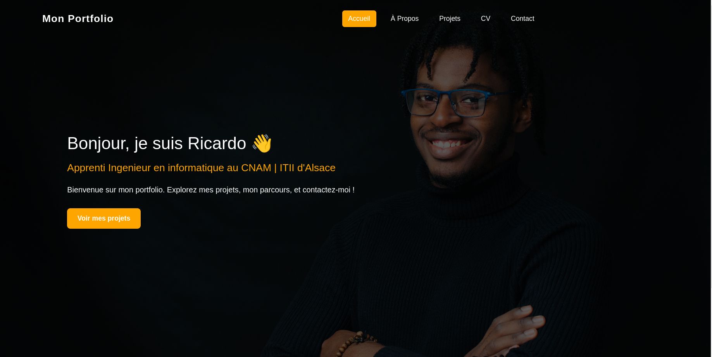

# 🚀 Portfolio Ricardo

Bienvenue sur mon portfolio personnel réalisé avec **Angular**, conçu pour présenter mon **parcours**, mes **projets** et mes **compétences** de manière claire, moderne et interactive.  
Il inclut également un formulaire de contact fonctionnel pour faciliter les échanges professionnels.

---

## 🖥️ Aperçu



---

## 🔧 Technologies utilisées

- 🅰️ **Angular** (standalone components, routing, services)
- 🎨 **SCSS / TailwindCSS** pour le style
- 🧠 **TypeScript** pour la logique
- 💌 **EmailJS** pour le formulaire de contact
- 💾 Gestion locale du système de **likes**
- ⚙️ Déploiement : **Render** & hébergement des assets

---

## 📁 Structure des Sections

| Section     | Description |
|-------------|-------------|
| **Accueil** | Présentation rapide, photo professionnelle, bouton d'action |
| **À propos** | Mon profil, mes objectifs et technologies maîtrisées |
| **Projets** | Liste interactive de projets, détails, images, likes |
| **CV**      | Diplômes, expériences, compétences, outils & langues |
| **Contact** | Formulaire avec validation, envoi via EmailJS |

---

## 📦 Fonctionnalités principales

- ✅ Interface **responsive** (mobile / tablette / desktop)
- ✅ Animation douce et effets visuels modernes
- ✅ Gestion des **likes** locale avec `localStorage`
- ✅ Possibilité d’ajouter un **lien optionnel** pour chaque projet
- ✅ Design soigné et sombre avec **fond dynamique**
- ✅ Images générées ou redimensionnées pour chaque projet
- ✅ **CV téléchargeable** en PDF

---

## 🚀 Lancer le projet en local

```bash
# 1. Cloner le repo
git clone https://github.com/Ricdrum14/portfolio-angular.git
cd portfolio-angular

# 2. Installer les dépendances
npm install

# 3. Lancer le serveur de développement
ng serve

# 4. Accéder à l'application
http://localhost:4200
```

---

## 🗂️ Organisation du code

```
src/
├── app/
│   ├── components/         # Composants Angular (footer, navbar, etc.)
│   ├── pages/              # Pages du site (about, projects, contact...)
│   ├── services/           # Services pour les projets
│   ├── models/             # Interfaces & classes (Project, ProjectType, etc.)
│   └── assets/             # Images + CV PDF
└── environments/           # Fichier d’environnement
```

---

## 💼 Auteur

- **Ricardo Annis**  
  👨‍💻 Apprenti Ingénieur Informatique – CNAM / ITII Alsace  
  🌐 [Mon site web](https://portfolio-ric-app.onrender.com/)  
  📧 Contact via le [formulaire](https://portfolio-ric-app.onrender.com/contact)

---

## 📜 Licence

Projet open-source à usage personnel et professionnel.  
Vous êtes libre de vous en inspirer en mentionnant l’auteur original.
